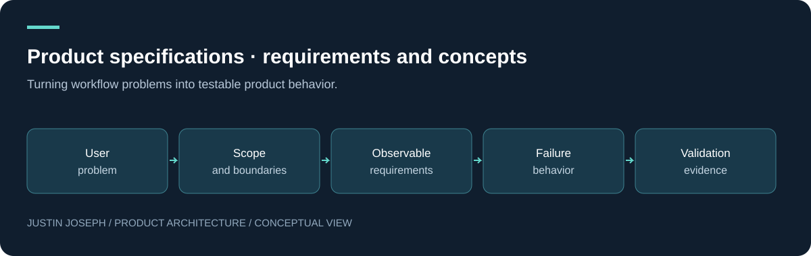

# Product specifications · requirements and concepts

Turning workflow problems into testable product behavior.

**Justin Joseph · Product Manager — FinTech, Trading Platforms & Decision Systems**

[Read the detailed case study](docs/portfolio.md) · [Explore the flagship](https://github.com/justin5128/trade-platform-case-study)

## Product problem

A feature name does not tell a team how to handle delayed data, duplicate submissions, incomplete work or a failed dependency.

## Objective and users

Express product intent through scope, acceptance criteria, failure behavior and validation plans.

**Users:** Product and engineering collaborators, designers and workflow operators.

## Constraints

Confidential business logic, asynchronous dependencies, migration risk and evidence limits.

## Architecture and decisions

The specifications describe generic boundary behavior. They are freshly authored public examples, not internal schemas, production contracts or executable implementation instructions.

Keep core workflow requirements separate from research concepts. Use observable acceptance criteria without inventing performance targets.

## Evolution and evidence

Ten specifications cover existing product themes and future concepts. A supporting project register also reflects backup, content and local-AI exploration. Individual document status makes the distinction explicit.

This documentation was written for the portfolio in September 2026. It describes product work and design reasoning; it does not claim independently verified adoption, returns or performance improvements.

## My role and learning

My contribution spans product requirements, workflow design, architecture decisions, hands-on diagnosis, AI-assisted development and iteration. AI-assisted implementation is part of the process; this is not a claim that I independently hand-coded every component.

Good requirements include uncertainty, recovery and the evidence needed to declare success.

## Explore

- [Detailed documentation](docs/portfolio.md)
- [Portfolio profile](https://github.com/justin5128)
- [Disclosure boundary](SECURITY.md)

## Intentionally excluded

This repository is a sanitised product and architecture case study. Production source code, credentials, proprietary analytical methods, operational configurations and confidential business logic are intentionally excluded.

---

© Justin Joseph. Portfolio documentation. Production implementation and proprietary methods are not included.
